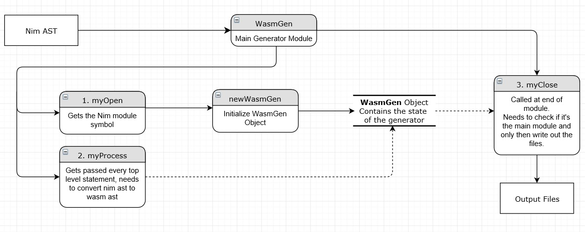

Notes
=====

This document contains random thoughts and notes on how I should implement the codegen and how I understand the compiler generation pass. 

Please note that this document is *very* WIP, I may start talking about something and get sidetracked. I'll try to keep rewriting sections of it until it makes sense, so if you have questions or find something unclear, please write an issue or notify me some other way.

Codegen pass
------------

Here is what I understand of the code generation pass:  
the generator module (cgen, jsgen, vmgen etc) exports a `const`, the pass, that receives the module graph (which to my understanding is the ast after it's type checked and lowered).   
This pass is composed of 4 procs, normally called ``myOpen, myOpenCached, myClose, myProcess``.

These four procs operate on (the same) context object, that generally holds a rope structure which holds the target code generated.

`myOpen` receives the module symbol and is the place in which the context is initialized.   
Then `myProcess` is called for every top level statement, and is where the ast of the statement is converted to target source code (usually by a proc named `gen`).  
Lastly, `myClose` is called, which closes the module.

These passages are repeated for all modules used by the project.

A simplified graph:


Overview
--------

The main idea behind this backend is to transform nim ast into "wasm" ast. This ast is defined in [compiler/wasm/wasmast](https://github.com/stisa/Nim/tree/nwasm/compiler/wasm/wasmast.nim), and doesn't follow a standard, at least for now. 
The generation is divided in 2 main phases:
1. nim ast -> wasm ast
2. wasm ast -> bytecode

The first phase happens in `wasmgen`, and is the actual backend nim sees.
The other phase happens in `wasmencode` and is mostly decoupled from the previous, meaning that it could be "easily" changed to output wast (wasm textual representation), an html page with inlined js and wasm as an array of uint8, ..., etc.

Another module that may be of interest is `wasmrender`, which tries to print out a json-like representation of the wasm ast.

### File list
Most of the relevant files are either in a wasm folder or have wasm in the name (wasmgen wasmutil wasmsys...) , the changes to other files are just one or two lines to make nim recognize wasm as a target. The actual wasm translation is only in `wasmgen`, and I substitute `wasmsys.nim` to `system.nim` so I can try out changes incrementally, before implementing the whole thing.

- `compiler/wasm` contains wasm ast definition, along with some convenience procs, json-like renderer, encoder to wasm bytecode etc
- `compiler/wasm/wasmglue.tmpl` contains the templates for html and js parts of the generator. The Js part is used when passing `-r` to run via nodejs
- `compiler/wasmgen.nim` (and `wasmutils.nim`) is the code generation pass
- `lib/system/wasmsys.nim` is the `system` module the wasm backend uses, so we can implement `system` little by little. Will eventually go away once wasm can compile the full system module
- `tests/wasm` contains some tests, that may be run with nodejs (`nim wasm -r <test.nim>`)


Nim to Wasm
-----------

First of all, only _ONE_ wasm module is produced. Much like it happens with the js backend, only the functions actually called in the _main_ module are compiled.  
As an example, lets say we have module A with 100 procs, and the main module B which imports module A and calls a single function, lets say `a`. Only the proc `a` is actually produced in the wasm module.
```nim
# module A
proc a(x: int): int = x*2
#proc b...
#...proc hundred

# module B
import A
var x = 123
echo a(x)
```
Once `echo a(x)` reaches `myProcess`, and the function `a` goes in `gen`, we have 3 possibilities:
1. `a` is a magic proc
2. `a` is a proc we already generated
3. `a` is a proc we need to generate

Lets see these cases:
1. each magic is a bit different and is handled in `callMagic`
2. lucky! Do nothing
3. the proc generation happens in `genProc`

After this, the arguments are generated and lastly the call is generated. Note we distinguish imported (from js) procs as they are hoisted in the function index space, so the index needs to be adjusted in the generation pass. I don't particularly like this coupling, but it's the simplest way I could think of. 

Every `var/let/const` section is handled in `gen` (TODO: move to its own proc?).
The single variables are stored sequentially in linear memory. The position in memory is saved in `symbol.offset` (FIXME: for now). 
We then have two possibilities:
1. the owner of the symbol is a module ( `=>` top level)
2. the owner is a proc ( `=>` definition is inside a proc)

In case **1**, we store the var linearly in the data section of the wasm module. 
As an example, let's consider `var x: seq[int32]`. Notice I didn't initialize the seq.
We reserve the space of the pointer to the length of the seq (4bytes for now). The initialization of 
the seq will store a length+data pair, sequentially, on the linear memory and update the pointer reserved
before to point to the length. Strings, refs and pointers work in a similar way.
Now lets consider a concrete value, eg `var x: int32`. This will reserve 4 bytes of linear memory, and is
functionally equivalent to `var x: int32 = 0`.
This happens in `gen` and `store` (and is also probably one of the worst designed parts, so help welcome in specifying this).
Note the `symbol.offset` is set to the linear memory index of the start of the value, eg a `ref` will have it set to the first byte
of the pointer, while a concrete value will have it set to the first byte of the concrete value.

Case **2** is still in flux.

### Exceptions
Should I forward exceptions to the js side, eg. by a `throw toJsStr(<wasmstringmessage>)`, or just `trap` in wasm?
Meh. `trap`for now.

### Semantics
I **really** need to solidify a set of semantics and stick to it.

**tyString, tySeq** are represented by a pointer to a length+data block, eg:
```
  [ptr][otherdata...][len][str/seq data]
                      ^
                      ptr points to here
```
**tyPtr,tyRef** etc (pointers types basically) are a ptr to a data block (like above, but no `len` block)

**tyArray** is a nice chunk of memory that gets passed around as a pointer to the first byte of the array by
the backend, but this pointer is never actually stored in the wasm binary. Which to my understanding is pretty normal,
it's basically an implicit pointer.

**tyInt, tyFloat, tyChar, tyBool** etc, basically everything that is representable as a single wasm value (btw wasm
values are i32, i64, f32, f64, and i64 doesn't even existing in practice as the version implemented in browser is
limited to 32bits integers) is directly copied. Thus these are passed around by value. What happens when I need
to pass a value as a `tyVar`? Good question. I'm not sure. Atm every is in the nice, big heap, also known as `WebAssembly.Memory`. Why? It was simpler to understand. Also the logic for store/load operation is easier if I don't
need to distinguish between things local to a particular function and everything else. The single var introduced in wasm
functions is `result`.

### Global/Local/Heap
Should I use wasm locals/globals? The problems is where to store the map from `PSym` to an index into the local/global space.
In an ideal world, I could simply make use of `TLoc`, but sadly that is optimised for rope structure as used by all other
nim backends. I could use the `k` field of `TLoc` and introduce a `b: int` field to store the byte offset in memory I guess,
maybe if I put it around a `when defined(hasWasmBackend)` nim maintainers won't hate me too much.
Currently, I use the offset field in `PSym`. This seems to work well enough, for now.

### Bytes alignment
I really need to drop the 4byte alignment for everything. It is especially bad when using the `getSize` proc, as an object
with 4 bool fields ends up 16bytes instead of the reported 4bytes, killing al subsequent store/load ops. The problem then 
becomes how to do load/store things smaller than 4 bytes in wasm. This could probably be overcome with a nice usage of
my super awesome `mapKind / mapStoreKind / mapLoadKind` triplet of procs, doing something like `i32.load8` and dealing with
the added complication of determining the correct offset. This is probably with I'll end up doing in the long run, probably
after I get to around half of `system.nim`, just to avoid having that nice feeling of satisfaction you get when completing
something. Also because by then I should have a rough implementation of most comparisons for ints, so I can ensure I don't
break everything by writing a bunch of test importing `console.assert` and feeding them to a `nodejs` runner.


References and links
------------
Some links that may prove helpful:

- [Go approach to WAsm](https://docs.google.com/document/d/131vjr4DH6JFnb-blm_uRdaC0_Nv3OUwjEY5qVCxCup4/preview#)
- [wat2wasm](https://cdn.rawgit.com/WebAssembly/wabt/aae5a4b7/demo/wat2wasm/)
- [wasm2wat](https://cdn.rawgit.com/WebAssembly/wabt/aae5a4b7/demo/wasm2wat/)
- [spec](https://webassembly.github.io/spec/core/index.html)